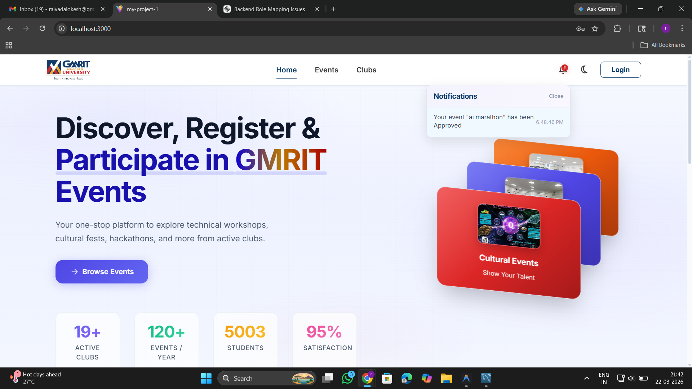
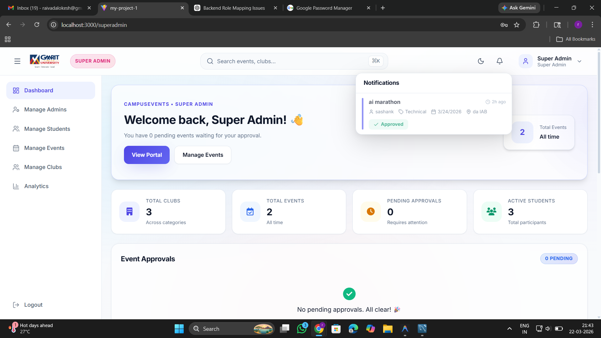
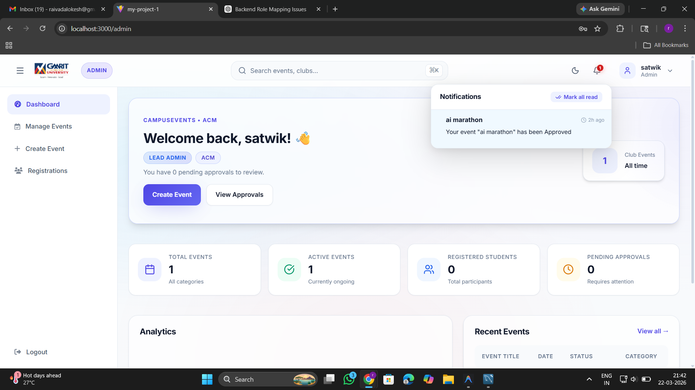
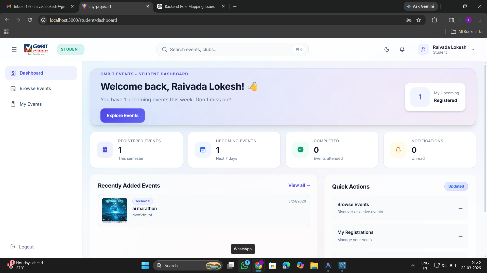
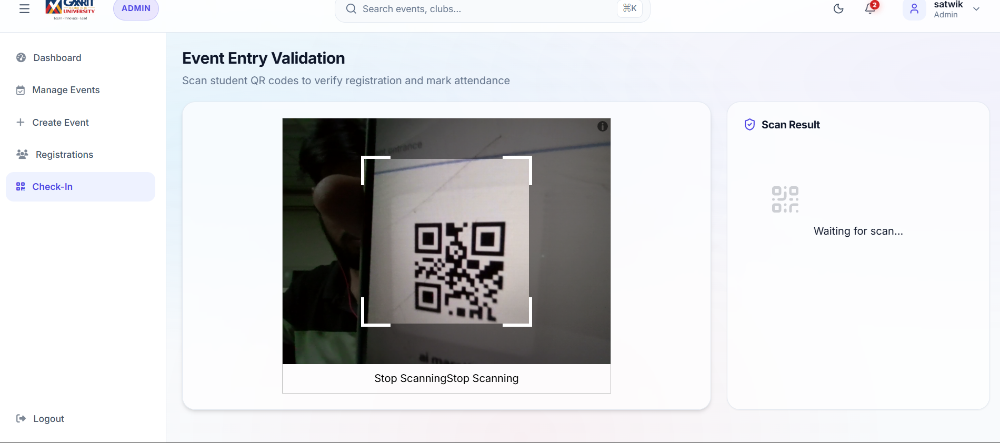

# 🎓 GMRIT Event Management System (EMS)


An advanced, full-stack, real-time **Event Management System** tailored for GMRIT. This highly scalable platform streamlines event discovery, student registration, club administration, and upper-level administrative approvals. By providing distinct portals for various roles, it ensures a seamless and professional experience for students, event organizers (club leads), and super admins.

---

## 📑 Table of Contents

- [Overview](#-overview)
- [System Architecture](#-system-architecture)
- [Key Features](#-key-features)
  - [Super Admin Module](#super-admin-module)
  - [Admin (Club Lead) Module](#admin-club-lead-module)
  - [Student Module](#student-module)
  - [Shared Features](#shared-features)
- [Technology Stack](#-technology-stack)
- [Database Schema](#-database-schema)
- [Platform Previews](#-platform-previews)
- [Getting Started](#-getting-started)
  - [Prerequisites](#prerequisites)
  - [Installation](#installation)
  - [Environment Variables](#environment-variables)
- [Available Scripts](#-available-scripts)
- [API Reference](#-api-reference)
- [Contributing](#-contributing)
- [License](#-license)

---

## 📖 Overview

The GMRIT EMS acts as a centralized hub for all campus activities, ranging from technical workshops and cultural fests to large-scale hackathons. It eliminates manual registration processes, introduces real-time QR code attendance validation, and offers a robust notification system powered by WebSockets.

---

## 🏗️ System Architecture

- **Frontend**: A highly responsive Single Page Application (SPA) built with React.js and Vite, featuring smooth animations using GSAP and a modern UI with Lucide React icons.
- **Backend**: A robust RESTful API built with Node.js and Express.js, utilizing a modular routing structure.
- **Database**: Relational data modeling using MySQL for high data integrity, linked via foreign keys to map users, clubs, events, and registrations securely.
- **Real-Time Communication**: Socket.io integration allows instant push notifications for event approvals and registrations without page refreshes.

---

## ✨ Key Features

### Super Admin Module
- **Platform Analytics**: Comprehensive dashboard tracking total users, active admins, event approval rates, and global registration metrics.
- **Admin Management**: Capability to create and manage Club Admins.
- **Event Oversight**: Centralized authority to approve, reject, or mandate changes on events proposed by Club Admins.
- **Club Management**: Oversee all active clubs and their respective heads.

### Admin (Club Lead) Module
- **Event Creation**: Propose new events with details like date, time, venue, and descriptions.
- **Registration Tracking**: Monitor real-time student registrations for their club's events.
- **Event Entry Validation**: Integrated QR Code Scanner (`html5-qrcode`) to validate student entry at the venue and mark attendance instantly.

### Student Module
- **Event Discovery**: Browse upcoming technical and cultural events categorized by clubs.
- **One-Click Registration**: Secure and instant event registration.
- **Digital Tickets**: Auto-generated QR codes (`qrcode.react`) for registered events, acting as digital entry passes.

### Shared Features
- **Role-Based Access Control (RBAC)**: Secure routing and API protection based on JSON Web Tokens (JWT).
- **Real-Time Notifications**: Instant alerts for event status changes and registration confirmations.
- **Image Uploads**: Multer-powered file uploads for event banners and posters.

---

## 🛠️ Technology Stack

| Category | Technologies |
| :--- | :--- |
| **Frontend Framework** | React 19, Vite |
| **Routing** | React Router DOM v7 |
| **UI / Styling** | Custom CSS, GSAP (Animations), Lucide React (Icons) |
| **QR Capabilities** | `qrcode.react`, `html5-qrcode` |
| **Backend Framework** | Node.js, Express 5 |
| **Database** | MySQL 8 (via `mysql2` driver) |
| **Authentication** | `bcryptjs`, `jsonwebtoken` (JWT) |
| **Real-Time** | `socket.io`, `socket.io-client` |
| **File Handling** | `multer` |
| **Email Services** | `nodemailer` |

---

## 🗄️ Database Schema

The core entities of the system are structured as follows:

1. **`super_admin`**: Top-level platform controllers.
2. **`admins`**: Club leads managed by Super Admins.
3. **`clubs`**: Organizations within the campus, each linked to an `admin_id`.
4. **`students`**: End-users who register for events, linked by unique `roll_no`.
5. **`events`**: Occurrences proposed by Admins and approved by Super Admins.
6. **`registrations`**: Mapping table tracking which students are attending which events, alongside attendance status.

---

## 📸 Platform Previews

### 🏠 Homepage
Discover, register, and participate in campus events.



### 📊 Super Admin Dashboard & Analytics
Platform overview, performance metrics, and pending approvals.



### 🛠️ Admin Dashboard
Manage club events, view registrations, and handle day-to-day operations.



### 🎓 Student Portal
Discover upcoming technical and cultural events and register instantly.



### 📱 Event Entry Validation
Scan student QR codes to verify registration and mark attendance.



---

## 🚀 Getting Started

Follow these instructions to set up the project locally for development and testing.

### Prerequisites

- **Node.js**: v18.0.0 or higher
- **MySQL**: v8.0 or higher
- **Git**

### Installation

1. **Clone the repository**
   ```bash
   git clone https://github.com/LokeshRaivada/campus-event-management-system.git
   cd campus-event-management-system
   ```

2. **Backend Setup**
   ```bash
   cd server
   npm install
   ```
   *Run the database migration script to scaffold tables (ensure your MySQL server is running):*
   ```bash
   node migrate.js
   ```

3. **Frontend Setup**
   ```bash
   cd ../client
   npm install
   ```

### Environment Variables

Create a `.env` file in the `server` directory and add the following configuration:

```env
# Server Config
PORT=5000

# Database Config (MySQL)
DB_HOST=localhost
DB_USER=root
DB_PASSWORD=your_mysql_password
DB_NAME=defaultdb
DB_PORT=3306

# Authentication
JWT_SECRET=your_super_secret_jwt_key

# Email Config (Nodemailer)
EMAIL_USER=your_email@gmail.com
EMAIL_PASS=your_app_password
```

---

## 📜 Available Scripts

In the **server** directory:
- `npm start` / `node server.js` - Runs the API backend.

In the **client** directory:
- `npm run dev` - Runs the React app in development mode with Vite hot-module replacement.
- `npm run build` - Builds the app for production to the `dist` folder.
- `npm run lint` - Runs ESLint to check for code quality issues.

---

## 🔌 API Reference (High Level)

The backend provides distinct API namespaces:

- `POST /api/auth/*` - User login, registration, and token validation.
- `GET /api/admin/*` - Club admin specific actions (create events, view registrants).
- `GET /api/events/*` - Public & protected endpoints for fetching event feeds.
- `GET /api/notifications/*` - Socket-triggered notification history.
- `GET /api/clubs/*` - Club directory and details.
- `POST /api/registrations/*` - Event sign-ups and QR code validations.

---

## 🤝 Contributing

Contributions, issues, and feature requests are welcome! 
1. Fork the Project
2. Create your Feature Branch (`git checkout -b feature/AmazingFeature`)
3. Commit your Changes (`git commit -m 'Add some AmazingFeature'`)
4. Push to the Branch (`git push origin feature/AmazingFeature`)
5. Open a Pull Request

---

## 📄 License

This project is licensed under the MIT License.
